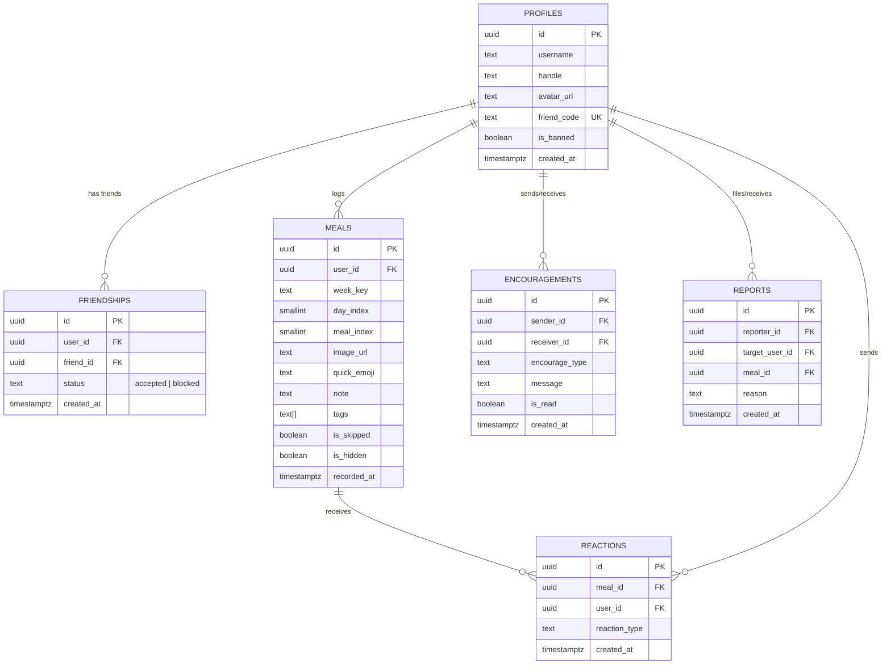

# 食事記録アプリ『mog』ソーシャル機能 要件定義書

## 1. システム概要 & 目的
- **プロダクト名**: `mog`（旧称: RATION）
- **キャッチコピー**: 「たべる、のこす、いきる。」
- **コンセプト**: SNSの「映え」や「完璧な食事管理」によるプレッシャーを排除し、7日×3食（21マス）のグリッドで日々のリアルな食事（自炊、コンビニ、スキップ/欠食、外食）をゆるく記録する。
- **ソーシャル機能の役割**: 
  - 過度な競争や承認欲求（いいね数競争、フォロワー数など）を生まない**「静かな相互監視」と「やさしい見守り（生存確認）」**。
  - 同じ時間を生きる友人同士が、お互いに気負わず「今日も生きて食べていること」を確認し合える場を提供する。

---

## 2. 機能要件

### 2.1 ユーザー・認証・セキュリティ（堅牢なアカウント基盤）
1. **認証方式**:
   - Supabase Auth による PKCE フローを採用。
   - メール ＋ パスワードレス（Magic Link / 6桁OTPコード）、または OAuth（Google/Apple）によるセキュアな認証。
2. **データの公開分離**:
   - `auth.users`（メールアドレス等の認証情報・非公開）と `public.profiles`（表示名・アバター・フレンドコード・公開情報）を物理的に分離。
3. **フレンドコードの自動発行**:
   - ユーザー登録時に `RN-XXXX` 形式（英大文字・数字4桁、誤読しやすい文字 `0, 1, I, O` を除外）の一意なフレンドコードを自動発行。
4. **EXIFメタデータ除去（プライバシー防衛）**:
   - 画像アップロード時にクライアント側（Canvas処理）で位置情報（GPS）や撮影機器メタデータを100%完全除去してリサイズ・WebP圧縮。

### 2.2 フレンド管理機能
1. **コード入力によるフレンド追加**:
   - 相手のフレンドコードを入力し、PostgreSQLストアドプロシージャ（RPC）を介してアトミックにフレンド関係を作成。
   - バリデーション（自分自身の追加拒絶、存在しないコード、重複追加防止、フレンド上限数チェック）。
2. **フレンド一覧 & 今日の3食ステータス表示**:
   - 登録済みフレンドのカード一覧表示。
   - 本日の「朝・昼・夜」の記録状況を3連ドットで表示（🟢記録済 / ⚪️スキップ / ⭕️未記録）。
3. **フレンド解除・ブロック**:
   - フレンド詳細や設定から即座にフレンド関係を解除・ブロック可能。

### 2.3 相互閲覧機能
1. **ともだちの様子（Companions モード）**:
   - フレンドカードタップで「今週の7×3マスグリッド」モーダルを展開。
   - 週間サマリー（記録数 X/21、スキップ数、自炊数など）と性格称号バッジ（例: `🍳 丁寧な暮らし（仮）`、`🏪 コンビニの亡霊`、`⏳ 省エネサバイバー` 等）を表示。
   - マスタップで拡大写真、メモ、タグを閲覧。
2. **最近のmog（Timeline モード）**:
   - フレンド全員の最新の食事記録を時系列でカード表示。

### 2.4 ライトコミュニケーション機能
1. **やさしいことば（Encouragements）**:
   - 6種の固定フレーズ（`🍵 おつかれさま` / `👏 えらい` / `🌿 ゆるくいこう` / `✨ 今日も最高` / `🤝 一緒にがんばろ` / `🍙 おなかすいた`）。
   - 連打防止（同一フレンドへの送信インターバル制御）。
2. **リアクションスタンプ（Reactions）**:
   - 食事マスに対してスタンプを送信（`🍵 おつかれさま` / `👏 えらい` / `🌿 ゆるくいこう` / `🤤 おいしそう` / `🏆 映えなさ満点`）。
   - 送信時のパーティクルアニメーション演出。

### 2.5 トラスト & セーフティ（不適切コンテンツ・NSFW対策）
1. **構造的防御**:
   - 全体公開タイムラインを廃止し、フレンドコード直接交換によるクローズドな関係性に限定。
2. **通報（Report） & 即時ブロック（Block）**:
   - 食事詳細画面に「🚩 この投稿を通報」ボタンを設置。
   - 通報と同時に、閲覧側の画面で画像を即座にモザイク/黒塗り非表示化し、相手を即座にブロック。
3. **自動コンテンツモデレーション（AI検知）**:
   - クライアント側（nsfwjs）またはバックエンド（Edge Function / Cloud Vision API SafeSearch等）で不適切画像を自動スキャンし、アップロードを遮断。
4. **利用規約（TOS） & アカウントBAN**:
   - 悪質ユーザーに対する管理者BAN機能（`profiles.is_banned = true` によるAPI遮断）。

---

## 3. データベース設計（PostgreSQL / Supabase）

